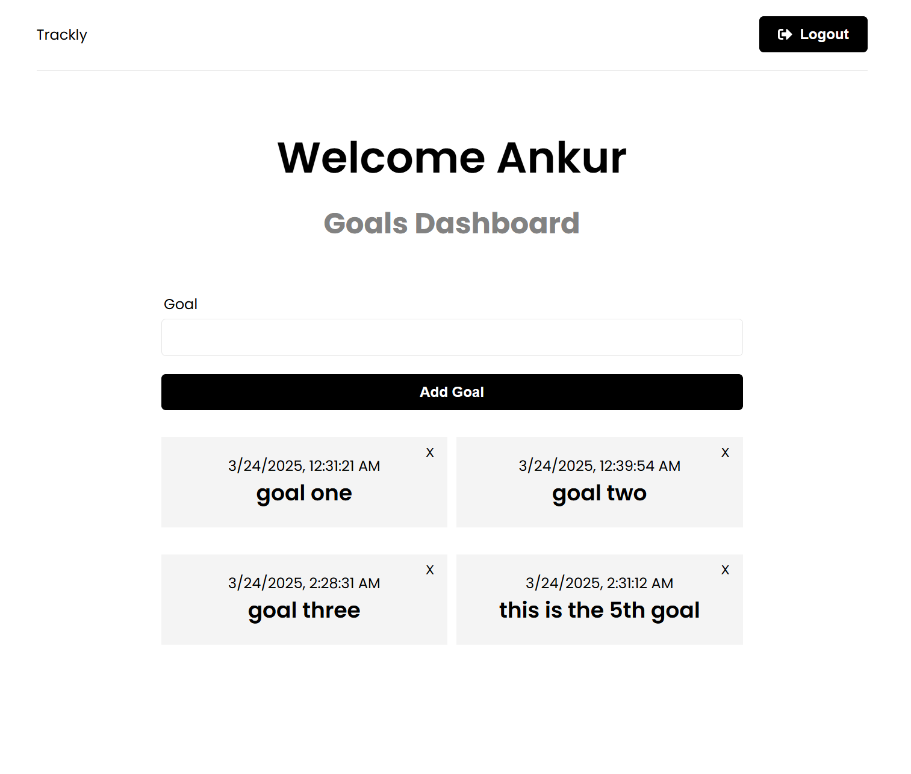

# Goal Tracking App

A full-stack MERN (MongoDB, Express, React, Node.js) application for creating and managing personal goals. Users can register, login, and maintain a list of goals.

## Features

- User authentication (register, login, logout)
- Protected routes and endpoints
- JWT authentication
- CRUD operations for goals
- React frontend with Redux Toolkit for state management
- Express backend API
- MongoDB database integration

## Tech Stack

### Frontend
- React 19
- Redux Toolkit for state management
- React Router DOM for navigation
- Axios for HTTP requests
- React Toastify for notifications
- React Icons for UI elements
- Vite as the build tool

### Backend
- Node.js
- Express.js
- MongoDB with Mongoose ODM
- JWT for authentication
- Bcrypt.js for password hashing
- Express Async Handler for error handling

## Project Structure

```
goal-setter-app/
├── backend/
│   ├── config/
│   │   └── db.js
│   ├── controller/
│   │   ├── goalController.js
│   │   └── userController.js
│   ├── middleware/
│   │   ├── authMiddleware.js
│   │   └── errorMiddleware.js
│   ├── models/
│   │   ├── goalModel.js
│   │   └── userModel.js
│   ├── routes/
│   │   ├── goalRoutes.js
│   │   └── userRoutes.js
│   └── server.js
├── frontend/
│   ├── public/
│   ├── src/
│   │   ├── app/
│   │   │   └── store.js
│   │   ├── components/
│   │   │   ├── GoalForm.jsx
│   │   │   ├── GoalItem.jsx
│   │   │   ├── Header.jsx
│   │   │   └── Spinner.jsx
│   │   ├── features/
│   │   │   ├── auth/
│   │   │   │   ├── authService.js
│   │   │   │   └── authSlice.js
│   │   │   └── goals/
│   │   │       ├── goalService.js
│   │   │       └── goalSlice.js
│   │   ├── pages/
│   │   │   ├── Dashboard.jsx
│   │   │   ├── Login.jsx
│   │   │   └── Register.jsx
│   │   ├── App.jsx
│   │   ├── index.css
│   │   └── main.jsx
│   ├── .gitignore
│   ├── eslint.config.js
│   ├── index.html
│   ├── package.json
│   └── vite.config.js
├── .env
├── .gitignore
└── package.json
```

## Setup and Installation

### Prerequisites
- Node.js
- npm or yarn
- MongoDB Atlas account or local MongoDB installation

### Environment Variables
Create a `.env` file in the root directory and add the following:

```
NODE_ENV=development
PORT=5000
MONGO_URI=your_mongodb_connection_string
JWT_SECRET=your_jwt_secret
```

### Installation

1. Clone the repository:
   ```
   git clone <repository-url>
   cd goal-setter-app
   ```

2. Install dependencies for backend:
   ```
   npm install
   ```

3. Install dependencies for frontend:
   ```
   cd frontend
   npm install
   cd ..
   ```

4. Run the application in development mode:
   ```
   npm run dev
   ```
   This will run both frontend and backend concurrently using the `concurrently` package.

### Running Separately

- Run backend only:
  ```
  npm run server
  ```

- Run frontend only:
  ```
  npm run client
  ```

## API Endpoints

### Users
- `POST /api/users` - Register a new user
- `POST /api/users/login` - Authenticate a user
- `GET /api/users/me` - Get user data (Protected)

### Goals
- `GET /api/goals` - Get all goals (Protected)
- `POST /api/goals` - Create a new goal (Protected)
- `PUT /api/goals/:id` - Update a goal (Protected)
- `DELETE /api/goals/:id` - Delete a goal (Protected)

## Frontend Routes

- `/` - Dashboard (Protected)
- `/login` - Login page
- `/register` - Registration page

## Authentication Flow

1. User registers or logs in through the frontend
2. Server validates credentials and returns a JWT token
3. Token is stored in localStorage
4. Token is included in the Authorization header for protected API calls
5. Protected routes and API endpoints check for valid token before granting access

## State Management

Redux Toolkit is used for state management with the following slices:
- `auth` - Manages user authentication state
- `goals` - Manages user goals state

## Deployment

- Versel

## Future Enhancements

- Add goal categories
- Implement goal deadlines and reminders
- Add social sharing features
- Implement dark mode
- Add data visualization for goal progress
- Mobile responsive design improvements

## License

MIT

## Author

Ankur